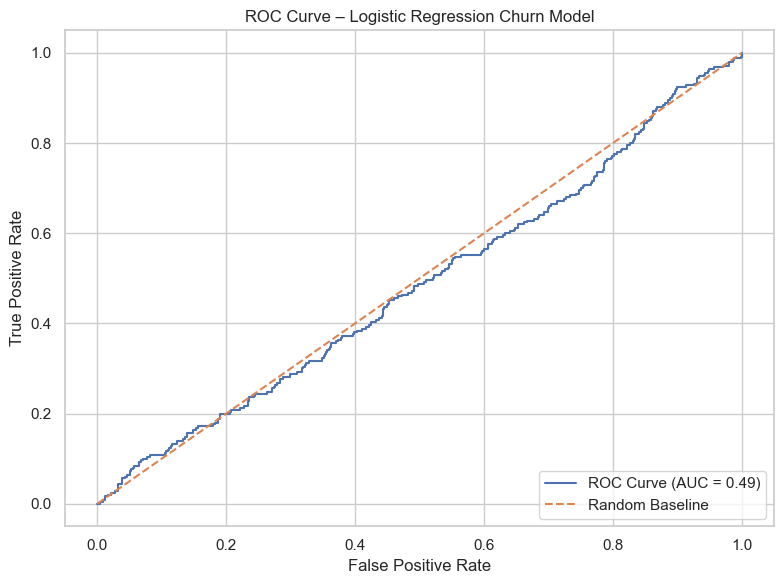
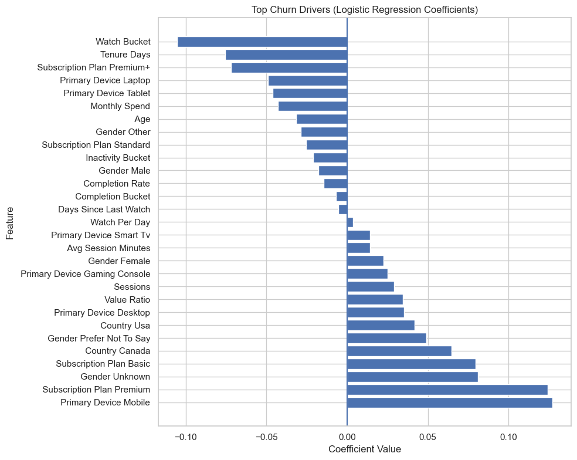

# Netflix 風 解約予測分析 (Churn Analysis)

  
[English](readme/English_README.md) | [日本語](readme/jp_README.md)

## プロジェクト概要

このプロジェクトは、サブスクリプション型サービスにおける顧客解約（Churn）を分析・予測することを目的としています。  
ユーザー行動とエンゲージメントデータを基に、解約の要因を探り、ビジネス上の洞察を得るための解析パイプラインを構築しました。

###### ※ レポートの調査結果はリポジトリの `business_report` セクションにまとめられています
---

## データについて

- ユーザー数: 8,431
- 目的変数: `churn`（1 = 解約, 0 = 継続）

### 特徴量グループ
| カテゴリ | 特徴量 |
|---------|---------|
| 属性 | 年齢, 性別, 国 |
| サブスクリプション | プラン, 月額支出 |
| 行動 | セッション平均時間, セッション数, 1日あたり視聴時間 |
| 継続性 | 在籍日数, 最終視聴日からの経過日数 |
| 視聴完了 | 視聴完了率 |
| エンジニアリング | 閾値バケット（視聴量, 不活性, 完了率） |
| 価値 | 視聴時間 / 支出 |

---

## 特徴量エンジニアリング

- `watch_per_day`: 1日あたりの視聴時間
- `days_since_last_watch`: 最終視聴からの日数
- `completion_rate`: 視聴完了率
- `value_ratio`: 視聴価値指標（視聴時間 ÷ 支出）

これらは単純な属性値ではなく、ユーザー行動の変化を捉えるために設計されました。

---

## モデリング

- モデル: ロジスティック回帰（基準モデル）
- 学習: 行動特徴量とサブスク特徴量を用いた教師あり学習

### 評価結果
- Accuracy: 0.50
- ROC-AUC: 0.49
- Churn Recall: 0.49
- Churn Precision: 0.14

---

## 可視化とインサイト

以下の可視化を通じて、解約傾向を分析しました:

### ROCカーブ
### ROC Curve

解約予測の性能を可視化。

### 混同行列

真陽性・偽陽性・真陰性・偽陰性の状況を確認。

### モデル係数図

各特徴量が解約リスクに与える影響度を分析。

※ GitHub リポジトリ内の `visuals/` に保存済み。

---

## 分析から読み取れること

- エンゲージメント低下が解約に強く結びつく
- 経過日数や視聴完了率が解約リスクを示唆
- 属性要素（年齢・国など）は弱いが、行動特徴は強い影響

---

## 改善と今後の展望

- 非線形モデル（LightGBM等）による改善
- 時系列的変化分析
- SHAP 等による特徴量の解釈性向上

---

## 🛠 使用技術

- Python,
- Pandas,
- Scikit-learn,
- Matplotlib,
- Seaborn,
- Jupyter Notebook
